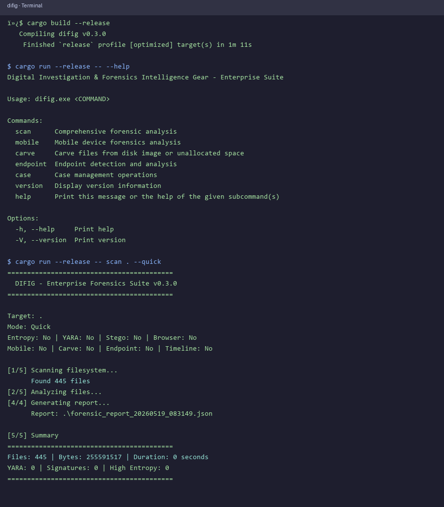

# difig

**Digital Investigation & Forensics Intelligence Gear**

A high-performance, automated command-line forensics tool built in Rust for scanning directories, extracting metadata, calculating file integrity hashes in parallel, and generating structured forensic reports.


## Demo



## Features

- **Parallel Processing**: Uses Rayon for concurrent SHA-256 hashing and metadata extraction
- **Entropy Analysis**: Calculates Shannon entropy to detect encrypted/compressed files
- **Magic Bytes Detection**: Identifies file types beyond extensions
- **Comprehensive Metadata**: Extracts timestamps, permissions, file sizes
- **Structured Reports**: Generates JSON forensic reports with full chain-of-custody data
- **Progress Tracking**: Real-time progress bars with indicatif
- **Hidden File Control**: Optionally include/exclude hidden files and directories

## Installation

### From Source

```bash
git clone https://github.com/yourusername/difig.git
cd difig
cargo build --release
./target/release/difig --help
```

### Pre-built Releases

Download the latest release for your platform from the [releases page](https://github.com/yourusername/difig/releases).

## Usage

### Basic Scan

```bash
./difig scan ./evidence_drive -o case_report.json
```

### Quick Mode (Metadata Only, No Hashing)

```bash
./difig scan ./evidence_drive -o case_report.json --quick
```

### With Entropy Analysis

```bash
./difig scan ./evidence_drive -o case_report.json --entropy
```

### Include Hidden Files

```bash
./difig scan ./evidence_drive -o case_report.json --all
```

### Command Options

| Option | Description |
|--------|-------------|
| `-o, --output <PATH>` | Output path for JSON report (default: current directory) |
| `--quick` | Skip hashing, metadata only |
| `--entropy` | Calculate Shannon entropy for each file |
| `-a, --all` | Include hidden files and directories |
| `-h, --help` | Show help |
| `-V, --version` | Show version |

### Version Info

```bash
./difig version
```

## Output Example

```json
{
  "tool_version": "0.1.0",
  "scan_timestamp": "2026-01-26T16:25:18.115459800+00:00",
  "target_path": "/path/to/scan",
  "total_files_scanned": 1281,
  "total_bytes_scanned": 676512912,
  "files_with_errors": 0,
  "artifacts": [
    {
      "path": "/path/to/scan/document.pdf",
      "size": 24576,
      "sha256_hash": "abc123...",
      "modified_time": "2026-01-26T10:30:00Z",
      "file_type": "pdf",
      "entropy_score": 7.8923416,
      "permissions": "100644",
      "is_hidden": false,
      "error": null
    }
  ]
}
```

## Architecture

```
src/
├── main.rs          # CLI interface (clap)
├── lib.rs           # Core types (FileArtifact, ForensicReport)
├── scanner.rs       # walkdir-based filesystem traversal
├── analyzer.rs      # Rayon parallel processing
└── reporter.rs      # JSON report generation
```

### Core Components

- **Scanner**: Recursive directory traversal with hidden file filtering
- **Analyzer**: Parallel file analysis using Rayon for concurrent processing
- **Reporter**: Structured JSON output for forensic chain of custody

### Dependencies

- `clap` - CLI argument parsing
- `walkdir` - Recursive filesystem traversal
- `sha2` + `hex` - SHA-256 hashing
- `chrono` - Timestamp handling
- `serde` + `serde_json` - Report serialization
- `rayon` - Parallel data processing
- `indicatif` - Progress bars

## Why Rust?

- **Memory Safety**: Prevents buffer overflows and memory corruption critical for forensics
- **Zero-Cost Abstractions**: High-level code with C++ performance
- **Fearless Concurrency**: `Send` and `Sync` guarantees safe parallel processing
- **Static Typing**: Catches errors at compile time

## Testing

```bash
cargo test
```

All tests verify core functionality:
- Entropy calculation
- SHA-256 hashing
- Scanner hidden file filtering
- Report generation and serialization

## Security Considerations

- Tool does not modify target files (read-only access)
- Cryptographic hashes ensure evidence integrity
- Timestamps preserved in RFC3339 format
- Errors logged without halting scan

## License

MIT License - see LICENSE file for details.

## Contributing

1. Fork the repository
2. Create a feature branch
3. Make your changes
4. Ensure tests pass
5. Submit a pull request

## Acknowledgments

- The Rust Team for memory safety guarantees
- The walkdir, rayon, and clap maintainers
